# Salary Prediction for Data Roles in the U.S. (Glassdoor 2020)

*Franco Pérez Rivera — Data Portfolio Project – 2025*

  
  

## 0. Table of Contents

1. [Project Overview](#1-project-overview)  
2. [Project Goals](#2-project-goals)  
3. [Dataset Structure](#3-dataset-structure)  
4. [Executive Summary](#4-executive-summary)  
5. [Insight Deep Dive](#5-insight-deep-dive)  
   - [Data Cleaning and Feature Engineering](#a-data-cleaning-and-feature-engineering)  
   - [Exploratory Data Analysis (EDA)](#b-exploratory-data-analysis-eda)  
     - [Target Variable: `avg_salary`](#1-target-variable-avgsalary)  
     - [Numerical Variables](#2-numerical-variables)  
     - [Tools](#3-tools)  
     - [Categorical Variables](#5-categorical-variables)  
   - [Cost of Living Adjustment](#4-cost-of-living-adjustment)  
   - [Modeling Results](#c-modeling-results)  
6. [Recommendations](#6recommendations)  
7. [Technical Details](#7-technical-details)  
8. [Caveats and Assumptions](#8-caveats-and-assumptions)

## 1. Project Overview

This project analyzes U.S. data-related job listings from 2020, aiming to understand the factors that influence salary levels in the data science job market. Using a dataset collected from Glassdoor and enriched with cost of living estimates, the goal is to extract actionable insights on how different job characteristics, company attributes, and geographic regions impact salary outcomes.

This information can be especially valuable for:

- **Job seekers**, who want to understand what affects salary offers and which roles or skills are most lucrative.
- **Recruiters and HR teams**, interested in benchmarking compensation based on job type and technical requirements.
- **Policy makers and workforce analysts**, exploring trends in tech labor markets across U.S. regions.

By analyzing both raw salary values and adjusted purchasing power (based on regional living costs), the project offers a comprehensive perspective on compensation in the U.S. data industry.

## 2. Project Goals

- **Evaluate key factors** that influence salaries in data-related roles, including job title, experience level, industry, and technical requirements.

- **Analyze regional salary differences**, adjusting for cost of living across U.S. states to better reflect real-world purchasing power.

- **Transform and prepare the dataset** through cleaning, feature extraction, and recategorization to enable effective modeling and interpretation.

- **Build predictive models** using both linear and tree-based approaches to estimate salaries based on job, company, and location characteristics.

- **Compare modeling approaches** in terms of accuracy, interpretability, and suitability for salary prediction use cases.

## 3. Dataset Structure

The dataset consists of approximately 950 job listings for data-related roles in the United States, originally scraped from Glassdoor in 2020. Each record includes a combination of structured and unstructured information, such as:

- Job title, location, and description
- Company size, industry, revenue, and Glassdoor rating
- Estimated salary range (min and max)
- Required technical tools and skills (e.g., Python, SQL, AWS)

To support different phases of analysis and modeling, the dataset was transformed into three tailored versions:

- **`df_analysis`**: Cleaned and deduplicated for exploratory data analysis (EDA).
- **`df_modeling_tree`**: Includes all listings (with duplicates), optimized for tree-based models that benefit from pattern repetition.
- **`df_modeling_linear`**: Deduplicated and includes a weight column to preserve statistical influence in linear regression models.

Each version contains approximately 40 features, covering:
- Job metadata (title, description, location)
- Extracted features (e.g., experience, tool knowledge, job category)
- Recategorized company attributes (e.g., industry, revenue, size)
- Binary flags for relevant technical tools (e.g., Python, SQL, AWS)

## 4. Executive Summary

This project explores salary trends in data-related roles across the United States, based on approximately 950 job listings scraped from Glassdoor in 2020. The goal was to identify the key factors that influence compensation and to develop a predictive model capable of estimating market-aligned salaries.

### a. Key Findings

- **Average salary across all listings**: **$101.5K**
- **Highest-paying role**: *Data Scientist* (**$115.8K** average)
- **Lowest-paying role**: *Data Analyst* (**$66.0K** average)
- **Seniority impact**: *Senior roles* earned on average **$30.7K more** than entry-level positions
- **Industry differences**: *Tech / Innovation* and *Health / Education* sectors offered the highest compensation
- **Company characteristics**: Large corporations and high-revenue firms paid up to **$15–20K more** than smaller companies
- **Regional trends**: Top-paying states included California, Massachusetts, and Illinois. However, salary adjusted for cost of living revealed that states like Illinois and Maryland offered greater **real purchasing power**

### b. Tools and Technical Skills

- Listings mentioning tools like **Scikit-learn**, **Keras**, **TensorFlow**, **Spark**, and **AWS** were associated with salary premiums of **$10K–$20K** above average
- In contrast, **Excel**, **Power BI**, and **Tableau** were linked to lower salaries, aligning with their prevalence in analyst roles
- Tool indicators were consolidated into grouped binary variables (e.g., *Python_Tools_Knowledge*, *Cloud_or_BigData_Knowledge*) to improve model interpretability

### c. Predictive Modeling

- A tuned **XGBoost Regressor** achieved the best overall performance:
  - **MAE**: $11.2K
  - **RMSE**: $18.2K
  - **R²**: 0.72 on the test set
- Linear models (e.g., Ridge Regression) underperformed, highlighting the benefit of non-linear methods in capturing complex salary dynamics
- Top predictive features included **job category**, **region**, **industry**, and selected company attributes

## 5. Insight Deep Dive

This section provides a detailed breakdown of the core analytical components of the project, including data preparation, exploratory data analysis, cost of living integration, and model development. Each step contributes to a deeper understanding of the factors shaping salary distributions across roles and regions.

### a. Data Cleaning and Feature Engineering

The raw dataset contained approximately 950 job listings for data-related roles in the U.S., collected from Glassdoor in 2020. To support different modeling strategies and ensure analytical flexibility, three tailored datasets were created:

- **`df_analysis`**: Used for exploratory data analysis (EDA), with duplicate listings removed to avoid statistical bias.
- **`df_modeling_tree`**: Designed for tree-based models (e.g., Random Forest, XGBoost), retaining all duplicates to leverage repeated patterns.
- **`df_modeling_linear`**: Prepared for linear and regularized models, duplicates removed, and a **weight column** added to preserve the frequency of each unique observation.

A series of feature engineering steps were then applied to convert raw and unstructured data into structured, model-ready variables:

1. **Salary Extraction**:  
   The `avg_salary` variable was computed as the midpoint between the minimum and maximum values in the original salary estimate. For linear models, this variable was transformed using the **Box-Cox method** to reduce skewness and approximate normality.

2. **Job Title Categorization**:  
   Job titles were standardized into a controlled set of categories (e.g., *Data Scientist*, *Data Analyst*, *Machine Learning Engineer*) using regular expression–based pattern matching. This reduced dimensionality and enhanced interpretability.

3. **Years of Experience**:  
   Numeric experience values were extracted from the job description text using regular expressions. Outliers (e.g., 80 years) were manually reviewed and corrected. Listings with no numeric match were classified using qualitative indicators such as “strong experience.”

4. **Experience Level Assignment**:  
   A unified `merged_experience_category` was created by combining numeric and textual data into five standardized levels: **Entry**, **Junior**, **Mid**, **Senior**, and **Unknown**.

5. **Tool Extraction**:  
   Over 20 technical tools and libraries (e.g., *Python*, *SQL*, *Spark*, *Tableau*, *AWS*) were identified through keyword searches. Binary flags were created for each, and only tools with sufficient frequency and relevance were retained for analysis and modeling.

6. **Industry and Sector Reassignment**:  
   Original company industry and sector fields were cleaned and consolidated into broader, interpretable categories such as **Tech / Innovation**, **Finance**, **Healthcare**, and **Public / Education** to reduce noise and improve model performance.

These transformations ensured that the dataset was both statistically robust and semantically meaningful for the downstream analysis.

### b. Exploratory Data Analysis (EDA)

The exploratory analysis focused on understanding the distribution of salaries and identifying which variables are most strongly associated with compensation. It also informed decisions around feature selection and model design.

#### 1. Target Variable: `avg_salary`

The average salary across job listings was approximately **$101.5K**, with a right-skewed distribution driven by a small number of high-paying roles—primarily senior positions in finance and technology.

To stabilize variance and improve model performance, both **log** and **Box-Cox transformations** were evaluated. The **Box-Cox–transformed version** (`avg_salary_boxcox`) achieved near-normality (Shapiro-Wilk p ≈ 0.73) and was selected as the target for linear models, while the original `avg_salary` was retained for tree-based models.

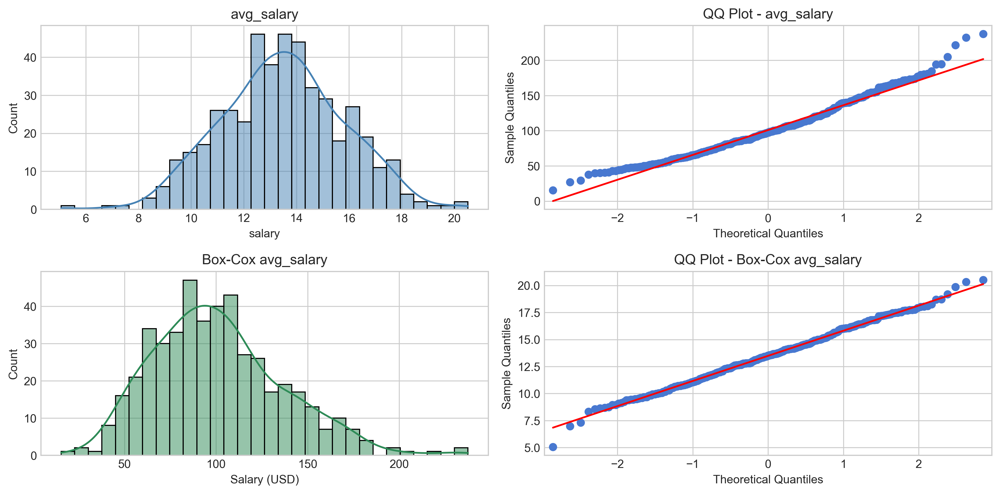

**Figure 1.** Distribution and QQ plots of the target variable after log and Box-Cox transformations. The Box-Cox version was selected for linear models due to improved normality (Shapiro-Wilk p ≈ 0.73).

#### 2. Numerical Variables

We analyzed all numerical features using histograms, boxplots, and the Shapiro-Wilk test for normality. Additionally, Pearson and Spearman correlations were computed to assess their relationship with the target (`avg_salary_boxcox`).

- **Rating**: Showed a weak but statistically significant positive correlation with salary. Companies with higher Glassdoor ratings tend to offer slightly better compensation.
- **Description Length** and **Company Age**: Displayed low or inconsistent correlations with salary and were excluded or recategorized during feature selection.

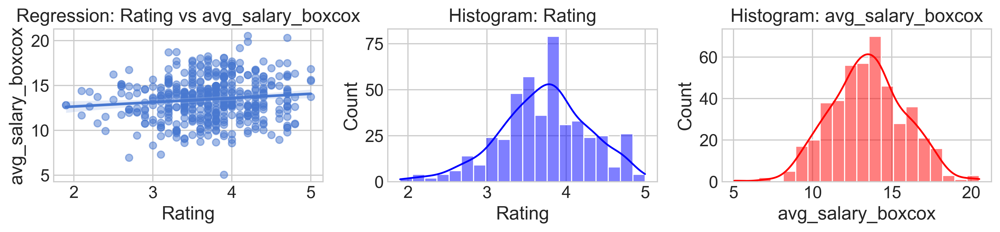

**Figure 2.** Visual analysis of numerical variables. Left: Regression between company rating and Box-Cox–transformed salary. Center: Distribution of Glassdoor ratings. Right: Distribution of the transformed target variable (`avg_salary_boxcox`).

#### 3. Tools

##### a. Tool Usage by Role

We analyzed tool prevalence across job categories using binary indicators for over 20 technical tools and libraries extracted from job descriptions.

Starting with the heatmap of tool usage by role, we observed a clear pattern: **higher-paying roles tend to require a broader and more advanced technical stack**.

- **Data Scientists** and **Machine Learning Engineers** frequently list tools such as Python, SQL, Spark, TensorFlow, and AWS—technologies commonly associated with machine learning, cloud computing, and big data.
- **Data Analysts**, on the other hand, rely heavily on SQL and Excel, with limited exposure to more complex tools.

This distribution aligns with expectations: **roles with higher technical demands tend to offer greater compensation**, reflecting both the required skill set and the complexity of the work.

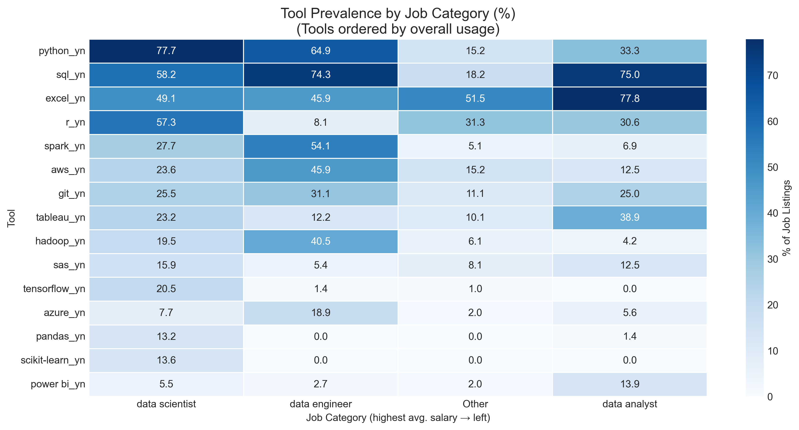

**Figure 3.** Prevalence of selected tools by job category. Roles are sorted from highest to lowest average salary (left to right).

##### b. Tool Analysis and Engineering

We began by analyzing the frequency of technical tools across all job listings. As shown in the first bar chart, the most requested tools were **Python**, **SQL**, and **Excel**, appearing in over 250 listings each. These tools were common across all roles, with variation in accompanying technologies.

We then assessed the **salary impact of each tool** using t-tests. The results revealed a clear pattern (see second chart):

- Tools with a **statistically significant positive impact** on salary included:
  - **Python-based libraries**: *Scikit-learn*, *TensorFlow*, *Keras*, *Pandas*
  - **Cloud or big data tools**: *Spark*, *AWS*, *Docker*

- Tools like **Excel**, **Tableau**, and **Power BI** showed **no significant effect** or were **negatively associated** with salary, aligning with their heavier usage in lower-paying analyst roles.

To simplify the model and reduce sparsity, we grouped selected binary tool indicators into two high-level features:
- **Python_Tools_Knowledge**: Indicates experience with core Python-based libraries
- **Cloud_or_BigData_Knowledge**: Summarizes exposure to cloud and distributed computing platforms

These engineered variables helped preserve signal strength while improving model interpretability.

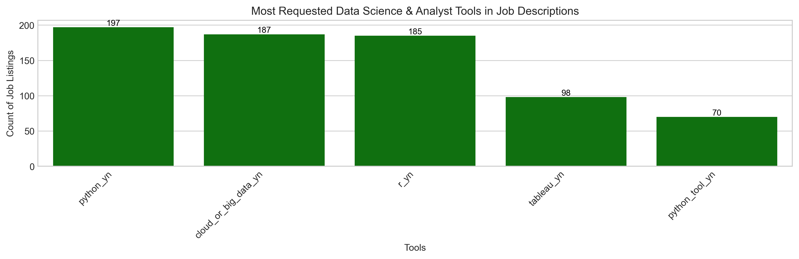

**Figure 4.** Most requested tools across data-related job listings.

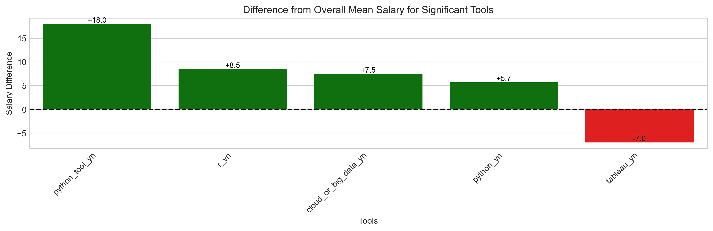

**Figure 5.** Average salary difference for roles requiring each tool, relative to the dataset mean. Only statistically significant results are shown.

#### 4. Cost of Living Adjustment

Raw salary values can be misleading when not adjusted for regional expenses, which vary significantly across the U.S.—especially in categories like housing, food, healthcare, and taxes. To provide a more realistic picture of compensation, we integrated **cost of living (COL) data** at the state level.

Data was sourced from the **Economic Policy Institute’s Family Budget Calculator**, which estimates the annual cost of living for a four-person household (two adults, two children). The calculation includes housing, food, transportation, healthcare, taxes, and other basic necessities.

Key findings:

- **California**, **Massachusetts**, and **New York** offered some of the highest nominal salaries, but also ranked among the most expensive states to live in.
- However, after subtracting living costs, states like **Illinois** and **Maryland** emerged as offering the **highest salary surplus** (i.e., disposable income after expenses).
- **Massachusetts** and **West Other** regions showed a relatively low surplus despite competitive nominal salaries.
- Interestingly, some lower-salary states with low cost of living—such as **Texas** or **Ohio**—offered compensation adjusted for purchasing power that rivaled wealthier regions.

> **Note:** New York's position may be misleading, as the analysis uses average statewide costs. Most data roles in the dataset are based in **Manhattan**, where actual living expenses are substantially higher than the state average.

This adjustment helped contextualize compensation by focusing on **real purchasing power**, providing a more accurate basis for evaluating job opportunities across regions.

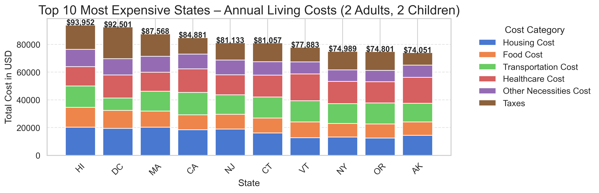  
**Figure 6.** Breakdown of annual living costs by category for the 10 most expensive states.

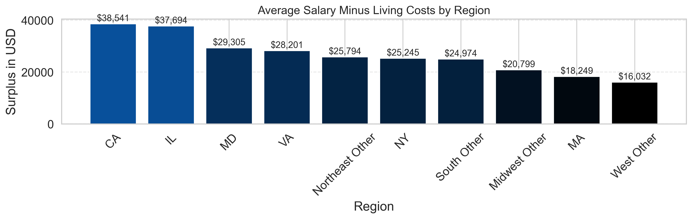  
**Figure 7.** Average surplus (salary minus living costs) by state or region.

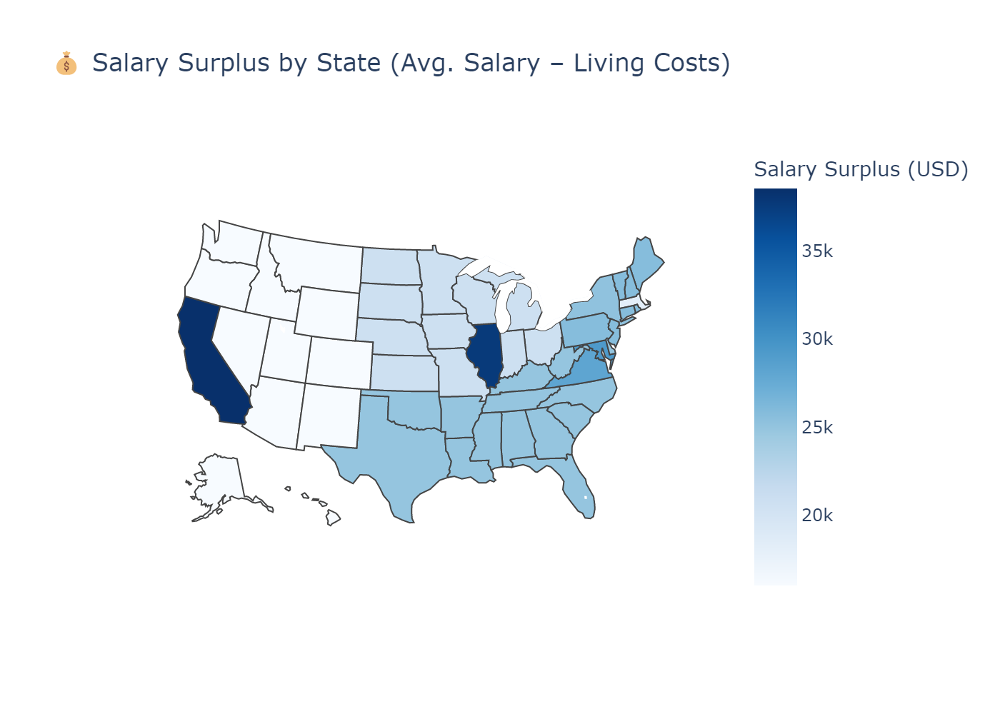  
**Figure 8.** U.S. map showing salary surplus by state, highlighting regions with the highest adjusted compensation.

#### 5. Categorical Variables

Several categorical features were analyzed to evaluate their relationship with salary and determine their inclusion in the final model.

##### a. Job Category

This was one of the strongest predictors of salary. After merging similar roles into four categories—*Data Scientist*, *Data Engineer*, *Data Analyst*, and *Other*—clear differences emerged.

- **Average salary for Data Scientists**: $115.8K  
- **Average salary for Data Analysts**: $66.0K  

The gap highlights how technical complexity and specialization impact compensation.

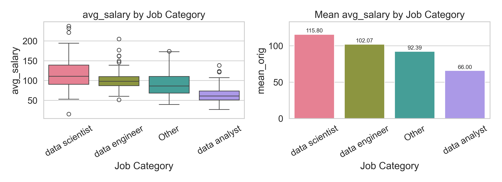  
**Figure 9.** Average salary by job category, ordered from highest to lowest.

##### b.Experience Category

Experience level, derived from both text and numeric extraction, showed a consistent gradient in compensation.

- **Senior roles** earned on average **$30.7K more** than entry-level roles.
- Mid- and junior-level positions fell in between, forming a meaningful middle tier.

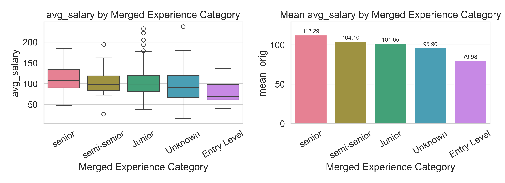  
**Figure 10.** Box-Cox–transformed salary by merged experience category.

##### c. Company Size (Recategorized)

Larger companies generally offered higher salaries. We grouped employers into four categories: *Small*, *Medium*, *Large*, and *Corporation / Multinational*.

- **Corporations**: $108.6K average  
- **Medium Companies**: $96.4K average  

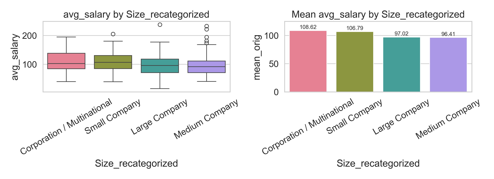  
**Figure 11.** Average salary by company size category.

##### d. Region (Grouped by State)

Geographic region significantly influenced salaries.

- **Top-paying states**: California ($123.4K), Massachusetts ($105.8K), Illinois ($105.6K)  
- **Lowest-paying regions**: Midwest Other and West Other, below $85K

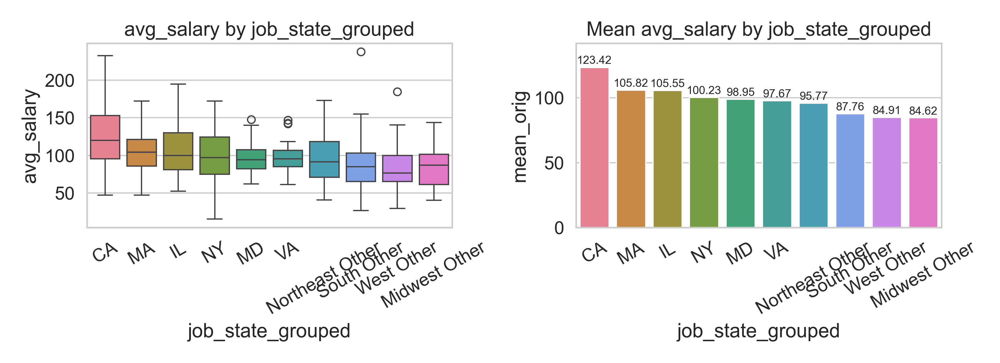  
**Figure 12.** Average salary grouped by state region.

##### e. Company Revenue (Recategorized)

A similar pattern was observed with revenue. Higher-revenue firms tended to offer better compensation.

- **Corporations / Multinational**: $112.3K  
- **Small/Micro Businesses**: under $96K on average

*(Graph omitted for brevity in this version, but included in full analysis)*

##### f. Industry (Recategorized)

Industry grouping revealed variation aligned with sector specialization.

- **Tech / Innovation**: $109.4K average  
- **Public & Essential Services**: $80.7K average

*(Graph omitted for brevity in this version, but included in full analysis)*

### c. Modeling Results

We developed two parallel modeling pipelines to predict average salary from structured job and company attributes:

- **Linear models** (with Box-Cox–transformed target) trained on deduplicated data with row weights
- **Tree-based models** (with untransformed target) trained on the full dataset, leveraging duplicates to enhance pattern learning

All models were built using **scikit-learn Pipelines** for consistent preprocessing (encoding, scaling, transformation) and tuned via **GridSearchCV** for reproducibility and performance optimization.

#### 1. Model Comparison

Multiple models were evaluated using 5-fold cross-validation and a held-out test set. Performance was assessed using MAE, RMSE, and R².

Key results on the test set:

- **XGBoost Regressor (Tuned)** delivered the best performance:
  - MAE: **$11.2K**
  - RMSE: **$18.2K**
  - R²: **0.72**

- Among linear models, **Ridge Regression** performed best:
  - MAE: **$13.6K**
  - R²: **0.29**
  - Performance was notably lower than tree-based models.

- Ensemble models (stacking) achieved marginal improvements but increased complexity.

| Model Description                        | Train MAE | Test MAE | Train R² | Test R² |
|------------------------------------------|-----------|----------|----------|---------|
| **XGBoost (Tuned)**                      | 2.11      | **11.19**| **0.992**| **0.716** |
| Stack v2 (xgb + lgb / Ridge)             | 3.90      | 12.24    | 0.976    | 0.701   |
| Stack v3 (rf + xgb + ridge / Lasso)      | 3.78      | 11.96    | 0.977    | 0.701   |
| Stack v1 (ridge + rf + lgb / LR)         | 3.86      | 11.85    | 0.975    | 0.699   |
| Random Forest (Base)                     | 5.17      | 12.42    | 0.951    | 0.685   |
| Random Forest (Tuned)                    | 5.20      | 12.87    | 0.953    | 0.676   |
| Random Forest (Reduced Features)         | 5.00      | 12.97    | 0.955    | 0.667   |
| LightGBM (Tuned)                         | 4.10      | 13.12    | 0.968    | 0.664   |
| LightGBM                                 | 7.90      | 14.89    | 0.906    | 0.645   |
| Stack v4 (all / GBoost)                  | 8.25      | 15.51    | 0.856    | 0.500   |
| Lasso Regression                         | 0.57      | 0.57     | 0.452    | 0.424   |
| Ridge Regression                         | 0.52      | 0.63     | 0.527    | 0.291   |
| *Linear Regression (BoxCox)*             | *11.95*   | *16.10*  | *0.295*  | *-0.287* |

**Table 1.** Final model comparison based on train/test MAE and R². The tuned XGBoost model outperformed all others across test metrics, while linear regression underperformed significantly.

#### 2. Feature Importance

Feature importance was extracted from the best-performing model (tuned XGBoost) to identify the most influential predictors of salary.

- **Job function** was the dominant factor: listings categorized as *Data Scientist* or *Data Analyst* had the largest impact on predicted salary.
- **Industry-region combinations** (e.g., *Tech / Innovation in CA*, *Health / Education in MA*) were also strong predictors, reflecting localized market dynamics.
- **Company location** (e.g., *California*, *Massachusetts*) and **organization type** (e.g., *Nonprofit*, *Corporation*) contributed significantly as well.
- Surprisingly, **technical tool experience** and **experience level** appeared with relatively lower importance in the final model.

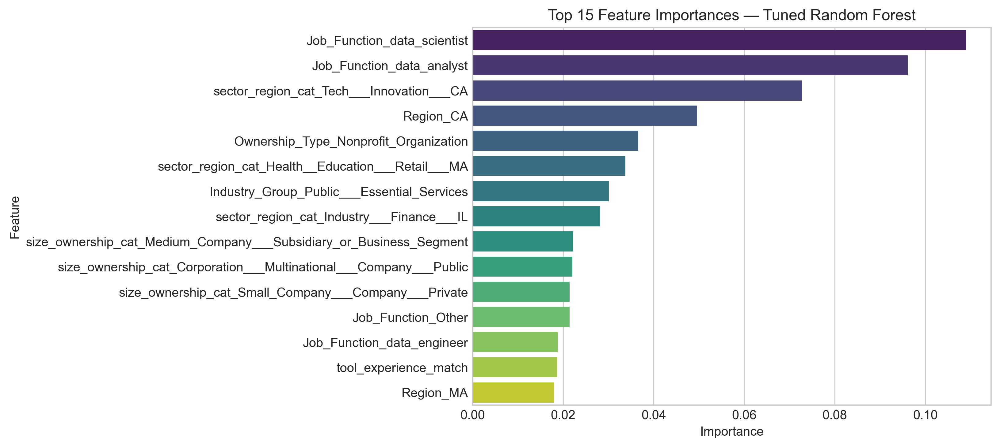
**Figure 13.** Top 15 features by importance.

## 6.Recommendations

Based on exploratory analysis, modeling results, and feature importance insights, the following recommendations are proposed:

### For Job Seekers

- **Prioritize high-value roles and skills**: Positions such as *Data Scientist* and *Machine Learning Engineer* consistently showed the highest average salaries (Figure 9). Additionally, tools like **Python**, **Scikit-learn**, **TensorFlow**, **AWS**, and **Spark** were associated with significant salary premiums (Figure 5).
- **Invest in technical depth**: Skills linked to machine learning, big data, and cloud computing were top predictors in both frequency and model importance (Figure 14). These tools distinguish higher-paying roles from more entry-level analyst positions.

### For Employers & Recruiters

- **Calibrate salary offers to technical requirements**: Listings requiring advanced tools (e.g., deep learning frameworks or distributed systems) should reflect this in compensation. Models showed that these tools align with higher salaries (Figures 4 and 5).
- **Use salary prediction tools to support compensation planning**: The tuned **XGBoost** model (Table 1) provides a high-performance framework for estimating market-aligned salaries and ensuring consistency across job postings.

### For Policy Makers & HR Strategists

- **Incorporate cost of living into compensation benchmarks**: Our adjusted analysis revealed that some regions (e.g., Illinois) provide higher *real* purchasing power than others with higher nominal salaries (e.g., Massachusetts or New York) (Figures 6–8). Employers offering remote positions or hiring across states should consider geographically adjusted salary bands.

### Use Case: Predictive Modeling

- The final XGBoost model can be integrated into internal HR tools to:
  - Benchmark proposed salaries against market expectations
  - Identify potential misalignments between role requirements and compensation
  - Simulate salary outcomes based on different role or company attributes

## 7. Technical Details

The project was implemented in **Python**, using industry-standard libraries for data analysis, modeling, and visualization:

- **Data processing**: `pandas`, `numpy`, `re`, `datetime`
- **Visualization**: `matplotlib`, `seaborn`, `plotly`
- **Modeling & evaluation**: `scikit-learn`, `xgboost`, `lightgbm`
- **Feature engineering**: Custom functions for text pattern matching, keyword extraction, and recategorization
- **Pipelines**: `scikit-learn` Pipelines were used for all models to streamline preprocessing (e.g., encoding, scaling, transformation) and ensure consistency across training and evaluation
- **Hyperparameter tuning**: Conducted via `GridSearchCV` with 5-fold cross-validation

### Data Structure

Three datasets were created to support different modeling approaches:

- `df_analysis`: Used for EDA; duplicates removed
- `df_modeling_tree`: Used for tree-based models; retained duplicates to preserve frequency patterns
- `df_modeling_linear`: Used for linear models; deduplicated with row-level weights applied

### Modeling Notes

- Target variable for linear models was transformed using **Box-Cox**, resulting in near-normal distribution (Shapiro-Wilk p ≈ 0.73)
- Tree-based models used the original salary in USD (`avg_salary`)
- Model evaluation was conducted using a stratified train/test split and performance was benchmarked via MAE, RMSE, and R² on both sets

## 8. Caveats and Assumptions

While this project provides valuable insights into salary dynamics for U.S. data-related roles, several limitations should be acknowledged:

- **Dataset Size**: The dataset includes approximately **950 job listings**, which is relatively small. As a result, some findings may not generalize across the broader job market or hold under different economic conditions.

- **Timeframe**: All listings were collected from **Glassdoor in 2020** and may not reflect post-pandemic changes in remote work, salary structures, or demand for specific roles and tools.

- **Salary Estimates**: The target variable (`avg_salary`) was calculated as the midpoint between the minimum and maximum salary estimates. True compensation packages (including bonuses or equity) were not available and may vary significantly.

- **Cost of Living Data**: Regional COL adjustments were based on **state-level estimates** from the Economic Policy Institute (EPI) for a four-person household. These may not accurately reflect individual or urban-specific expenses (e.g., Manhattan or San Francisco).

- **Feature Extraction**: Variables such as experience level and tool usage were extracted using **regex and keyword matching** from free-text job descriptions. This method may fail to detect non-standard phrasing, implicit requirements, or context-specific mentions.

- **Model Bias and Assumptions**:
  - Tree-based models retained duplicates, which could overweight listings from certain companies or regions.
  - Feature groupings (e.g., job categories, tools, revenue bands) involved simplifications that may obscure intra-group variability.
  - All models were trained and tested on data from the same year and platform; performance may vary in other contexts or over time.

